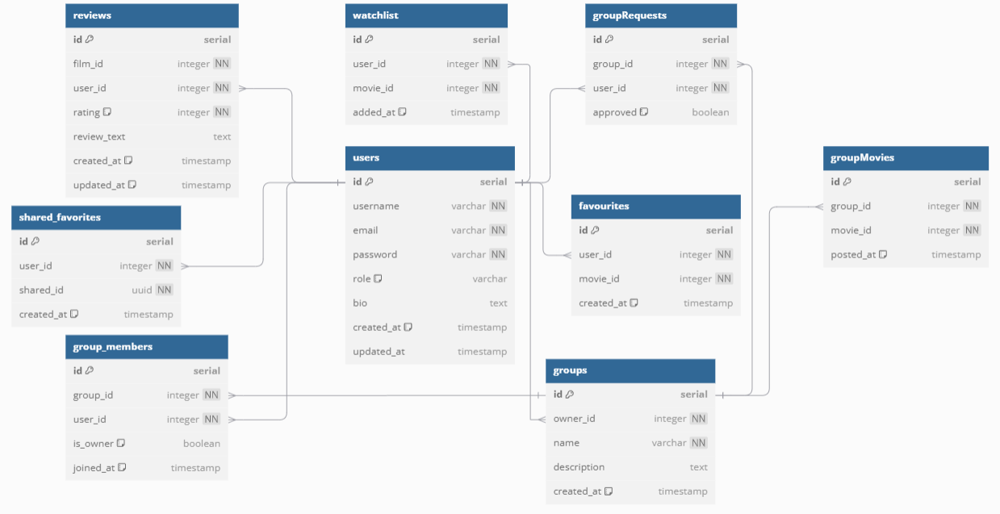

# EyeLandMovieApp Readme

## Project Overview

This project, **EyeLandMovieApp**, is a movie web application designed for movie enthusiasts. It provides access to open-source data from TMDB (The Movie Database) for movie details and Finnkino for showtimes at various theatres. Users can explore movies, access detailed information, and browse showtimes without the need to sign in. After signing up and logging in, users can create profiles, manage favorite movies, leave reviews, and join groups. The movie details page allows users to explore in-depth information about each movie, while the review feature lets signed-in users add comments and ratings. Users can also browse and read reviews from others. The app combines movie discovery, social interaction, and group management, delivering a captivating experience tailored for movie enthusiasts.

---

## Tech Stack and Standards

### Frontend Technologies

- **React**

  - Framework used for building user interfaces with component-based development and dynamic interactions.

- **HTML & CSS**

  - **HTML**: Defines the basic structure of the web pages and supports component rendering.
  - **CSS**: Handles page styling, including layout, typography, and colors, with responsive design for various screen sizes.

- **JavaScript**
  - Implements core functionalities such as state management, event handling, and API interactions.

### Backend Technologies

- **Node.js**

  - A runtime environment for building efficient, non-blocking server-side applications.

- **Express.js**
  - A web framework used to create REST APIs, handling client requests and database interactions.

### Database

- **PostgreSQL**
  - A relational database used for storing application data, including user information, movies, reviews, favorites, and group details.



---

## Installation

### Clone the project code

```bash
git clone https://github.com/EyeLandMovieApp-AWA-Group18/Project-Repo
```

### Frontend Setup

1. Navigate to the client directory:
   ```bash
   cd client
   ```
2. Install frontend dependencies:
   ```bash
   npm install
   ```
3. Start the frontend development server:
   ```bash
   npm start
   ```

### Backend Setup

1. Navigate to the server directory:
   ```bash
   cd server
   ```
2. Install backend dependencies:
   ```bash
   npm install
   ```
3. Start the backend server in development mode:
   ```bash
   npm run devStart
   ```

### PostgreSQL Database Setup

1. Create a PostgreSQL database and configure the database connection in the `.env` file.
2. Execute migration scripts to initialize the necessary database schema.

---

## API Endpoints

### Base URL

All endpoints are prefixed with `/api`

### Authentication

- **Many endpoints require JWT token in the Authorization header**
  ```text
  Authorization: Bearer <your_token>
  ```

### Endpoints Overview:

- **Authentication**: Register, login, logout, delete account  
  `/auth/register`, `/auth/login`, `/auth/logout`, `/auth/delete`
- **Groups**: Create, manage, and view groups, members, requests, and group movies  
  `/groups`, `/groups/:id`, `/groups/:id/members`
- **Watchlist**: Add, view, and remove movies from the watchlist  
  `/watchlist`
- **Favourites**: Add, view, and remove favourites movies  
  `/favourites`
- **Reviews**: Get, add, and delete reviews for movies  
  `/reviews/:film_id`
- **Search**: Search for movies  
  `/search`
- **Shared Favorites**: Manage shared favorites  
  `/shared-favorites`
- **Public Reviews**: Get all public reviews  
  `/public-reviews`

---

## Testing

- Automated tests are implemented for the API endpoints to ensure proper functionality.
- Tests encompass both positive and negative scenarios for critical endpoints such as Register, Login, Logout, Account Deletion, and Public Reviews.

### Testing Tools

- **Mocha** and **Chai** are used for testing.
- **Chai-Http** is used for HTTP assertions.

---

## The Project Team Members

Our team, **Group18**, consists of 6 members:

- **Mina Soltani**  
  Responsible for arranging meetings, managing team communications, designing the frontend (including the landing page), ensuring the web app's responsiveness, fetching movie data from TMDB, retrieving landing page data from TMDB, and handling related routes.

- **Pengfei Li**  
  Developed the search feature, favourites (saving and sharing), and optional watchlist feature; contributed to group feature (group page, group list, create/delete groups), authentication (using hooks and context for credentials, frontend for deleting account and sign-out), and database structure design.

- **Thach Nguyen**  
  Contributed to designing and refining the database, implemented backend functionality for user sign-up, and developed both frontend and backend for group features. Additionally, created comprehensive API documentation to support seamless integration and functionality.

- **Rohit Pariyar**  
  Led UI wireframe design for a user-friendly website layout and developed a dynamic homepage slideshow to highlight films in theaters, incorporating smooth transitions and responsive design to enhance the user experience.

- **Muhammad Tabish Tabish**  
  Completed delete functionality, deployed the website, and facilitated task sharing through GitHub backlog. Performed thorough testing using the REST Client extension to ensure seamless functionality.

- **Mingrui Cai**  
  Led project initialization and version management, developed the Movie Detail, Showtimes, Movie Reviews, and Browse Reviews features, and implemented responsive design for the related pages. Conducted positive and negative testing for Signin, Signout, Signup, Account Deletion, and Browse Reviews REST APIs.

---

## Link to the Application and GitHub

- **Live Application**: [EyeLandMovieApp](https://project-repo-movieapp-frontend.onrender.com/)
- **GitHub Repository**: [Project Repository](https://github.com/EyeLandMovieApp-AWA-Group18/Project-Repo)
